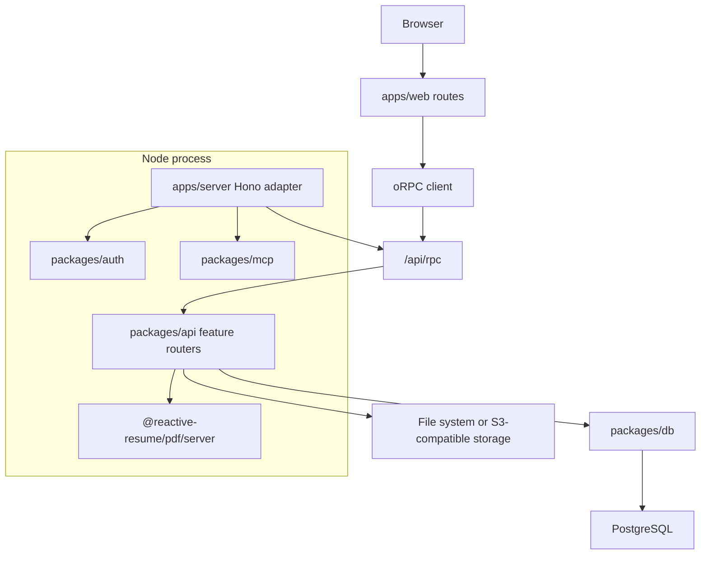

Reactive Resume is a pnpm/Turborepo monorepo. The product runs as one deployed Node.js process, while the source is split into a full-stack web app, a server adapter, and focused internal packages.

Internal packages are source-consumed through their `package.json` export maps. Import package subpaths, not another workspace's private `src` files.

---

## Runtime Shape



`apps/web` owns the TanStack Start experience. `apps/server` owns the production Hono process and mounts RPC, auth, OpenAPI, MCP, static uploads, schema JSON, and the built web app.

---

## Workspace Map

| Workspace | Ownership |
| --- | --- |
| `apps/web` | TanStack Start routes, web features, browser PDF.js preview/viewer code, PWA setup, oRPC browser client |
| `apps/server` | Hono route composition, production HTTP adapters, MCP transport, OpenAPI/well-known handlers, static file serving, startup checks |
| `packages/api` | oRPC procedures and feature-owned business behavior under `src/features/*` |
| `packages/auth` | Better Auth config, auth helpers, and exported auth types |
| `packages/db` | Drizzle client and schema; root `migrations/` stores generated migrations |
| `packages/env` | Server environment validation and root `.env` loading |
| `packages/schema` | Zod schemas and typed resume/page/template models |
| `packages/resume` | Pure resume-domain helpers, including JSON Patch behavior and network icon mapping |
| `packages/pdf` | React PDF document, template primitives, templates, font registration, and browser/server generation adapters |
| `packages/docx` | DOCX export generation |
| `packages/mcp` | MCP tools, prompts, resources, server card, and tool metadata |
| `packages/ui` | Shared Base UI/shadcn-style primitives and hooks |
| `packages/ai` | AI provider types, prompts, resume parsing/sanitization helpers, and model-facing tool contracts |
| `packages/import` | Resume importers |
| `packages/fonts` | Font metadata |
| `packages/email` | Email transport and templates |
| `packages/utils` | Narrow cross-cutting utilities with explicit export subpaths |
| `packages/config` | Shared development configuration |
| `tooling` | Development-only scripts and repo tooling |

---

## Boundary Rules

- Use `@reactive-resume/*` package exports for cross-workspace imports.
- Do not import another workspace through `apps/**`, `packages/**`, `@reactive-resume/*/src/**`, or a TypeScript path alias to another workspace's `src`.
- Keep browser-only code in web features or explicit browser subpaths.
- Keep server-only code in server packages or explicit server subpaths.
- Keep environment-neutral domain packages free of DB, HTTP, DOM, and app imports.
- Add public package exports deliberately. Wildcard exports are reserved for leaf-style public surfaces such as UI components/hooks and schema resume files.

The checks are executable:

```bash
pnpm exec turbo boundaries
pnpm exec biome check biome.json turbo.json tooling/grit/no-cross-workspace-src-imports.grit apps/web/tsconfig.json apps/*/turbo.json packages/*/turbo.json
```

---

## Feature Placement

When adding code, choose the owner by behavior:

| Change | Put it here |
| --- | --- |
| Route, loader, route-level server handler, or web workflow | `apps/web/src/routes` plus `apps/web/src/features/<domain>` |
| API procedure or authenticated business behavior | `packages/api/src/features/<domain>` |
| Pure resume data logic | `packages/resume` |
| Resume schema or template list shape | `packages/schema` |
| React PDF template/rendering behavior | `packages/pdf` |
| PDF.js canvas/viewer UI | `apps/web/src/features/resume` |
| DOCX export behavior | `packages/docx` |
| MCP tool/prompt/resource behavior | `packages/mcp` |
| Shared UI primitive/hook | `packages/ui` |
| Cross-cutting helper | Prefer a domain package first; otherwise add an explicit `packages/utils` export |

---

## Web Layout

`apps/web/src/routes` stays route-owned. Route files handle URL shape, loaders, redirects, metadata, and SSR flags.

Domain UI and browser-heavy implementation code lives under `apps/web/src/features`. Current feature areas include resume preview/export/public pages, command palette, auth, settings, theme, locale, and user menu behavior.

Generic app-local components remain in `apps/web/src/components`; shared reusable primitives live in `packages/ui`.

Dialog runtime state is centralized in `apps/web/src/dialogs/store.ts`, while dialog schemas and renderers are registered by domain under `apps/web/src/dialogs/{auth,api-key,resume}`.

---

## API Layout

`packages/api/src/routers/index.ts` exports the top-level oRPC contract. Feature modules under `packages/api/src/features/*` own their procedure modules, services, helpers, tests, and public package exports.

Avoid reintroducing technical-layer folders such as `services/` or `helpers/` at the package root. If a helper is used by one feature, keep it in that feature. If it becomes shared, name the shared capability explicitly and export it intentionally.

---

## PDF And Export Boundaries

`packages/pdf` owns React PDF generation:

- `@reactive-resume/pdf/browser` creates browser PDF blobs.
- `@reactive-resume/pdf/server` creates server PDF files.
- Template code stays under `packages/pdf/src/templates`.

Localized section-title resolution stays in the caller because it depends on web/server locale context. PDF.js preview and viewer code stays in `apps/web/src/features/resume`, not in `packages/pdf`.

DOCX export generation lives in `packages/docx`.

---

## MCP Boundary

MCP implementation lives in `packages/mcp`. It exposes canonical unprefixed tool names such as `list_resumes`, `read_resume`, and `apply_resume_patch`.

The server process imports MCP from `@reactive-resume/mcp` and injects the in-process oRPC router client. It must not import MCP code from `apps/web/src`.
